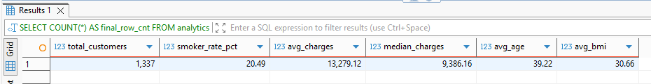
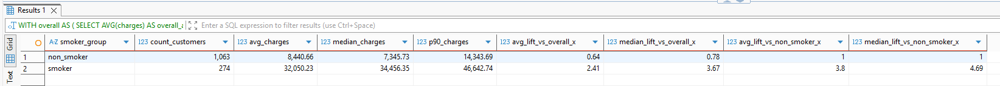
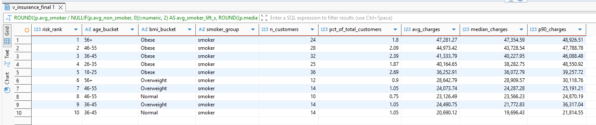

# Insurance Charges Drivers & High-Cost Risk Segmentation (SQL)

**Project type:** SQL Analytics Case Study (Portfolio)  
**Focus:** Quantifying key charge drivers and identifying high-cost risk segments  
**Tools:** PostgreSQL, DBeaver Ultimate  
**Grain:** 1 row = 1 customer record  

---

## 1. Business Context
Insurance pricing and underwriting depend on understanding which customer attributes are associated with higher expected medical costs. Common risk-related attributes such as **smoking status**, **age**, and **BMI** are frequently linked to cost differences and may materially impact insurance charges.

This project uses **SQL-only analysis** to quantify charge differences across customer attributes and produce **segment-level risk tables** that can support pricing differentiation, risk monitoring, and intervention prioritization.

---

## 2. Project Objectives
This analysis answers three core questions:

1. **Which factors show the strongest association with higher charges?**  
2. **How do charges change across BMI levels and smoking status together?**  
3. **Which customer segments represent the highest cost risk?**

---

## 3. Dataset
**Source:** Kaggle — *Insurance Dataset* by mirichoi0218  
https://www.kaggle.com/datasets/mirichoi0218/insurance

**Database:** `insurance`  
**Schema / Table:** `raw.insurance`

**Core fields used:**
- `age`
- `sex`
- `bmi`
- `children`
- `smoker`
- `region`
- `charges`

A cleaned, analysis-ready view was created to standardize types and derive:
- `is_smoker` (0/1)
- `age_bucket`
- `bmi_bucket`

---

## 4. Data Quality Notes
Before analysis, the dataset was validated for:
- Missing values across key fields
- Out-of-range sanity checks (age, BMI, charges)
- Category consistency (sex, smoker, region)
- Duplicate detection

The final analytical dataset contains **1,337 customer records** after removing exact duplicates.

---

## 5. Analytical Approach (SQL-Only)
The workflow follows a structured SQL approach:

1. Build an analysis-ready customer-level view (standardized fields + derived buckets)
2. Run data quality checks and duplicate detection
3. Compute baseline population and charge KPIs
4. Compare charges by **smoking status** (avg, median, p90 + lift metrics)
5. Evaluate interaction effects: **BMI bucket × smoking**
6. Rank top high-cost segments by **median charges** (robust to skew)

**Why median + p90?**  
Insurance charges are typically right-skewed, so median and tail metrics help reduce distortion from extreme outliers.

---

## 6. Final Outputs (Screenshot-Ready Tables)

### 6.1 Baseline Summary KPIs
A single-row KPI snapshot of the dataset composition and charge levels.

---

### 6.2 Charges by Smoking Status (Core Driver)
Charge comparison between smokers vs non-smokers, including:
- average and median charges
- p90 charges (high-cost tail)
- lift vs overall and lift vs non-smoker baseline

---

### 6.3 Interaction: BMI Bucket × Smoking
Segment-level view of how BMI categories behave differently for smokers vs non-smokers, including:
- segment size and % of total customers
- avg and median charges per group
- smoker vs non-smoker lift inside each BMI bucket

---

### 6.4 High-Cost Risk Segments (Top 10)
Top-ranked customer segments by **median charges**, segmented by:
- `age_bucket`
- `bmi_bucket`
- `is_smoker`

Includes segment size (% of total) and p90 charges to reflect tail risk.

---

## 7. Key Business Takeaways
- **Smoking status** is the strongest cost separator in the dataset and drives a clear high-cost tail.
- **BMI amplifies risk most strongly among smokers**, especially in overweight/obese categories.
- High-cost risk is concentrated in **smoker segments**, and the top-ranked segments are dominated by:
  - smoker + obese
  - older age buckets

These outputs can support:
- risk-based pricing adjustments
- underwriting rule refinement
- prioritizing high-risk cohorts for prevention or care management programs

---

## 8. Limitations
- This is an observational dataset; results show **association**, not causation.
- No medical history, claims breakdown, or chronic condition variables are available.
- Bucket thresholds (age/BMI) are analyst-defined and may differ across insurers.
- The dataset is relatively small; segment-level results should be interpreted with minimum-size filters.

---

## 9. How to Run
1. Load the dataset into PostgreSQL as `raw.insurance`
2. Open `queries.sql` in DBeaver
3. Run queries from top to bottom (each section outputs 1–2 tables)

---

## 10. SQL Features Used
- CTEs (`WITH`)
- Aggregations (`COUNT`, `AVG`)
- Robust statistics (`percentile_cont()` for median and p90)
- Bucketing (`CASE WHEN`)
- Window functions (`DENSE_RANK`)
- Safe math (`NULLIF`) for lift calculations
